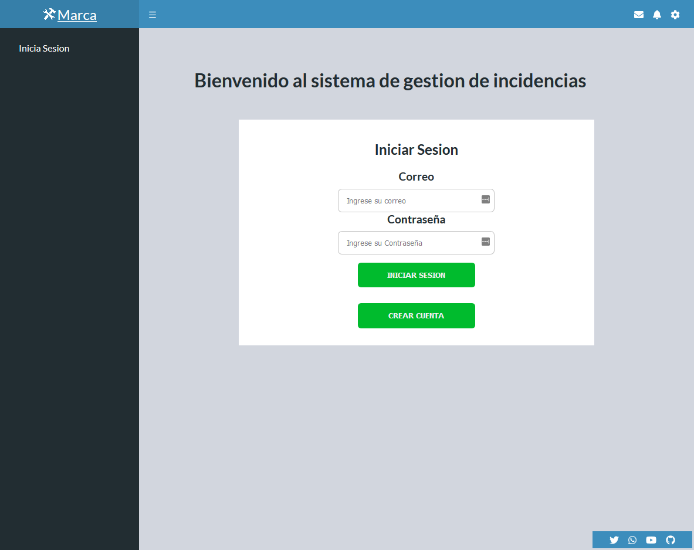
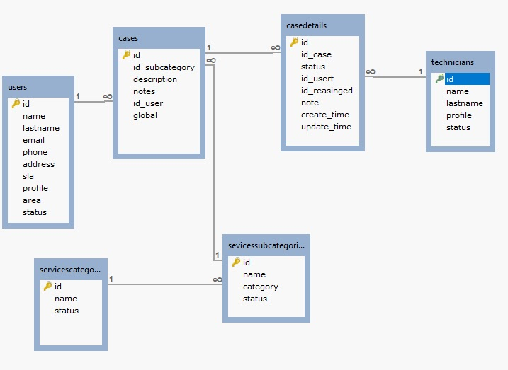

# About - Suppourtil

 ersonal Proyect Platzi Master - Cohort 3 - Grupo Ana Belisa

## Project description

Web app proyect for suppourt app based on WEB

## Scope

This application want to help to business to create operate and resolve problems and issues in our organization

Este protecyo tendra como alcance la creacion de un sistema de gestion de casos para soporte tecnico
The scope of this proyect is create a management system that recive cases and issues related to problems of your employees

- Register new users
- Create login for admin user and user standar
- Show the options below type of profile, user, technician or admin
- Allows modify the profile type as is need
- Creation of new events o issues, this will be created by users and by managed for a admin user, who assign this a technician
- The user will be informated of status of his event in his profile
- Technician can modify and add report of status, finally can be the status and mark it as finished

## Authors

- [Alexander Alvarez](https://github.com/AlexanderAlvarez9)

---

## Wireframes

- [Login](https://docs.google.com/drawings/d/1C5p-O7dgvajtuP4iEs6gqUMlV4xsQa3-owzjTcNc8S4/edit)
- [Enrolar Nuevos Usuarios](https://docs.google.com/drawings/d/15ZLCanCcz9_doBW3zIYOb6zLJs4AWDXqvgP1TbFXxPU/edit)
- [Enrrolar Servicio](https://docs.google.com/drawings/d/11ic77P5cxew2Qw3OwEaUo-4SVGkpZ-i_5LfpIQ04xZk/edit)
- [Crear Evento Usuario](https://docs.google.com/drawings/d/1IoPNlx51YLBDSTdgetv1h_oMDPS-2GVbRfY_XkcOzJ8/edit)
- [Listado Casos - Agentes](https://docs.google.com/drawings/d/1HhM1ZzabrWv3KKZjjAhaNPNixjgbwXobqCMsRtqTuTc/edit)

## Entregas

### Viernes 26 Junio

- Wireframes

### Viernes 3 Julio

- Mockups

### Viernes 10 Julio

- Diseñar base de datos para el proyecto personal y entregar documentación del diseño de la base de datos

### Viernes 17 Julio

- Desarrollo del Backend del Proyecto (CRUD) + Entregable de al menos 2 acciones

### Viernes 24 Julio

- Entrega muestra y Despliegue del Proyecto

### Viernes 14 Agosto

- Entrega FInal

---

## How to Install

For install just need…

1. Download or clone the repository
2. install in your local machine

```jsx
npm install
```

## How Run in dev mode
```jsx
npm run start
```


## Definiciones para el desarrollor

### Frontend

- Componentes created has NameOfComponent.jsx en ./src/components/Component.jsx
- Style for each component created in SASS has NameOfComponent.scss in ./src/assets/styles/components/Style.scss
- Test will be created has NameOfComponent.test.js in ./src/__test__/Test.test.js

## Technologies

### Frontend
- React based in components
- Sass how .scss
- Fontawesome
- Babel
- Eslint
- Webpack
- Prettier

### Backend
- Firebase as BaaS
* Firebase Authentication
* Firestore as data base

## Demo

You can see the demo live, [here](https://alexanderalvarez9.github.io/Itil-Support/)

## Image Preview



## Image Data Base Model in relational mode



Image Preview

# License

This Food Market is released under the [MIT License](https://opensource.org/licenses/MIT).

### I born at 29/06/2020